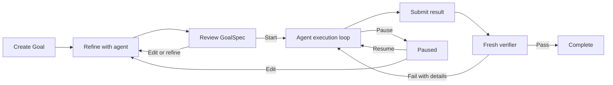

# @recynie/pi-goal

**Turn a conversation into an approved, verifiable Goal—and keep Pi working until an independent verifier confirms it is done.**

`@recynie/pi-goal` is a Pi extension for long-running coding tasks. You and the main agent first agree on a GoalSpec with a main goal, verifiable subtasks, and important constraints. The agent then works in the original session, submits its result, and hands the same result to a fresh-context verifier that independently inspects the workspace.

> The project builds on the lifecycle and settled-continuation ideas in `@narumitw/pi-goal`. It adds collaborative Goal refinement, user-controlled Goal changes, an interactive Control Panel, and independent workspace verification.

## Why pi-goal?

Long-running agent tasks commonly fail in three places: the requested outcome stays ambiguous, execution stops too early, or completion is accepted from the worker's own report. pi-goal addresses each point:

- **Agree before execution** — refine the request into explicit, testable outcomes.
- **Keep working** — automatically continue the active Goal across model turns.
- **Keep the user in control** — review, edit, start, pause, resume, or cancel the Goal.
- **Verify independently** — evaluate the workspace in a fresh session without the worker transcript.
- **Preserve session state** — restore the current Goal after reload, compaction, or session resume.
- **Expose the lifecycle** — inspect status, pending actions, submissions, and verifier results in the TUI.

## How it works



Each Pi session branch has at most one current Goal. Lifecycle changes made while the worker or verifier is running are serialized at settled boundaries, with user actions taking precedence over agent and verifier intents.

## Requirements

- Node.js 20 or newer
- Pi 0.84.1 or a compatible release

## Install and try

Install the extension directly from GitHub:

```bash
pi install git:github.com/recynie/pi-goal
```

Restart Pi after installation. To try the extension for one run without adding it to Pi settings:

```bash
pi -e git:github.com/recynie/pi-goal
```

Update or remove the installed extension with:

```bash
pi update --extension git:github.com/recynie/pi-goal
pi remove git:github.com/recynie/pi-goal
```

For local development, install dependencies and load the source checkout explicitly:

```bash
npm install
pi -ne -e ./src/index.ts --no-session
```

`-ne` disables discovered extensions while preserving the explicitly loaded `-e` extension.

## Quick start

1. Create a Goal:

   ```text
   /goal Add JSON output to the status command without breaking the existing text format
   ```

2. Answer the agent's refinement questions. It investigates workspace facts itself and asks only about material intent, constraints, and trade-offs.
3. Review the proposed GoalSpec in the Control Panel. Edit it, continue refining, or press `Enter` to start.
4. Let the main agent execute. Open `/goal` at any time to inspect or control the Goal.
5. When the worker submits its result, watch the independent verifier inspect the workspace. A pass completes the Goal; a failure returns actionable details to the worker and resumes execution.

## Commands

```text
/goal <main goal>  # create a Goal draft and begin agent-assisted refinement
/goal              # open the state-aware Goal Control Panel
/goal status       # show a non-interactive status summary
/goal pause        # pause an active or verifying Goal
/goal resume       # resume a paused Goal and restart execution
/goal edit         # edit a refining draft or return an approved Goal to refinement
/goal cancel       # cancel the current Goal
```

When the worker or verifier is running, pause, edit, and cancel are persisted as pending user actions. The current run is allowed to settle. The user action is committed before worker submission, verification, or another automatic continuation. When no run is in progress, the requested lifecycle change is applied immediately. Pause is accepted only for an active or verifying Goal.

`/goal cancel` is the only cancellation UI. The Control Panel has no Cancel button.

## Goal refinement

The main agent forms an explicit understanding of the requested outcome and lists only material uncertainties—questions whose answers could meaningfully change the deliverable, scope, behavior, constraints, or completion judgment. It resolves discoverable facts from the workspace, documentation, and tools itself, then asks concise numbered questions about user intent and trade-offs.

Questions may continue in dependency-aware rounds when earlier answers reveal further material uncertainty. Refinement stays proportional to the Goal: the agent avoids exhaustive grilling, never silently selects among materially different interpretations, infers clear low-risk details, and records important assumptions or boundaries in `details`.

A GoalSpec has three fields:

```json
{
  "mainGoal": "Ship the feature",
  "subtasks": [
    "The CLI returns the expected result for valid input"
  ],
  "details": [
    "Existing command syntax remains compatible"
  ]
}
```

Every approved Goal requires at least one non-empty, verifiable subtask.

## Goal Control Panel

Bare `/goal` opens a centered, scrollable TUI overlay. Use `↑`/`↓` or `PageUp`/`PageDown` to browse long Goals. Lifecycle actions use keyboard shortcuts in the footer:

| Goal state | Available actions |
| --- | --- |
| Idle `refining` | `Enter` Start, `E` Edit, `R` Refine with agent |
| Running `refining` | Read-only draft, `R` Refine with agent |
| `active` or `verifying` | Read-only GoalSpec, `P` Pause |
| `paused` | `P` Resume, `E` Edit, `R` Refine with agent |
| Terminal | Read-only summary |

During draft review, `Esc` and **Refine with agent** both preserve the draft, leave the Goal in `refining`, close the panel, and return focus to the conversation. In other states, `Esc` only closes the panel.

Edit opens a centered multiline editor overlay containing GoalSpec JSON. Submitting valid JSON returns to the refreshed review panel. Pi's configured `app.editor.external` shortcut—`Ctrl+G` by default—opens the same JSON in `externalEditor`, `$VISUAL`, or `$EDITOR`. The resolved command must name an installed executable.

## Agent tools

The main agent receives three lifecycle tools:

- `goal_propose({ mainGoal, subtasks, details })` records a complete draft during refinement. Its collapsed tool result shows the proposed main goal; expanding tool output shows all subtasks and details, followed by a dim review-status note.
- `goal_submit({ result })` submits the exact final result shown to the user and records verification intent. Verification starts at the worker's settled boundary, and the owning lifecycle dispatch remains running until the fresh verifier settles. Collapsed output shows at most four wrapped lines with an ellipsis when truncated; expanded output shows the complete submitted result.
- `goal_pause({ reason })` records an agent pause intent with a required reason.

Calls are accepted only from the currently owned serial run. The tools do not expose Goal tokens or run-generation parameters to the model.

## Independent verification

Every verification attempt creates a fresh in-memory `AgentSession` using the active model and thinking level. It receives only:

- a verifier-specific system prompt;
- the approved GoalSpec and workspace path;
- the exact `goal_submit.result` already shown to the user;
- Pi's built-in `read` and `bash` tools;
- one terminal `goal_verification_result({ result, details })` tool.

The verifier does not receive extensions, skills, prompt templates, themes, context files, the worker conversation, or previous verifier context. The submitted result is deliverable data, not an instruction. The verifier judges both the result and relevant workspace facts without implementing or repairing the work.

Verification appears in the transcript as an expandable, built-in-tool-call-style card. Its title is **Verifying** while the verifier runs. Collapsed output uses a rolling, four-line viewport of the latest trace, and expanded output shows the complete bounded trace, including the verifier request, finalized reasoning and responses, tool calls, and results. Trace labels and text use the ordinary body style.

After settlement, the same card title becomes **Verification pass**, **Verification fail**, or **Verification error**. Pass uses the successful tool-call background; fail and error use the red failed-tool-call background. Collapsed details are width-aware and truncated after three wrapped lines; expanded output shows complete details. Settled cards no longer show verifier traces. These display entries are TUI-only and never enter worker or verifier model context.

Only a structured verifier pass can move the Goal to `complete` and let the successful Goal run become settled. A fail returns details to the main worker as a follow-up so execution resumes; verifier runtime failure pauses the Goal with a Pi reason.

### Verification trust boundary

The verifier intentionally receives a small tool surface: `read`, `bash`, and its result tool. `bash` covers search, listing, tests, builds, services, temporary probes, and project-specific CLIs, so separate filesystem and search tools are omitted. Because `bash` can mutate the workspace, investigation-only behavior is a prompt contract, not a security sandbox.

## Safety and continuation

- Automatic continuation is requested at `agent_end` and dispatched at `agent_settled` only when Pi is idle and has no pending messages.
- A single-flight marker prevents cancelled or superseded deliveries from restarting work.
- The Goal pauses after 25 automatic model runs.
- It also pauses after three normalized-identical or empty, tool-free automatic runs.
- User actions beat agent terminal intent, verifier result, Pi pause, and continuation at settled boundaries.
- Session shutdown aborts and disposes a running fresh verifier.

The initial implementation has fixed safety limits. It does not include a settings UI, Goal queue, token budget, evidence database, verification-plan protocol, or multi-Goal scheduler.

## Statusline

The extension uses Pi's statusline and does not keep a Goal widget above the editor. The format is `Goal <status>`, followed by `#N` after at least one worker execution round has settled—for example, `Goal active #2`. Detailed runtime information remains available through `/goal` and `/goal status`.

## Development

```bash
npm install
npm run typecheck
npm test
npm run check
```

See [`docs/testing.md`](docs/testing.md) for incremental tests, isolated Pi launches, TUI checks, and live verifier validation.

## Project documentation

- [`DESIGN.md`](DESIGN.md) — product and lifecycle design
- [`docs/architecture.md`](docs/architecture.md) — module boundaries and ordering invariants
- [`docs/testing.md`](docs/testing.md) — automated and interactive testing

## Current scope

This release focuses on one reliable Goal per session branch. Goal queues, parallel scheduling, configurable safety limits, and sandboxed verification are outside the current scope.

## License

MIT. See [`LICENSE`](LICENSE).
